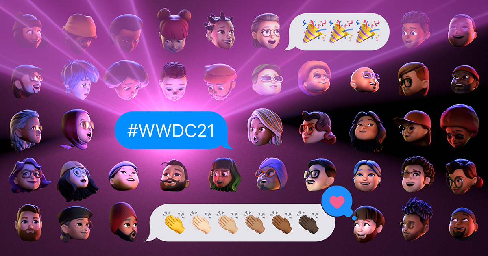
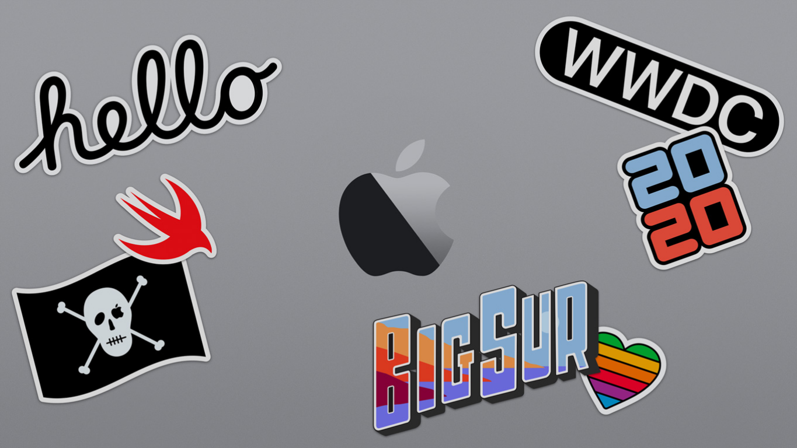

# 🎬 𝐖𝐖𝐃𝐂 

### ✨ 𝗪𝗵𝗮𝘁'𝘀 𝗻𝗲𝘄

 

  
  
  
  
  
  
  
 
   
  </a>
  

 

# WWDC2023
- **UIKit**
  - [Unleash the UIKit trait system](https://github.com/HARlBO/WWDC/blob/master/WWDC2023/Unleash-the-UIKit-trait-system.md)
 

# WWDC2022
 

# WWDC2021
- **Swift**
  - [What's New in Swift](https://github.com/HARlBO/WWDC/blob/master/WWDC2021/What's-new-in-Swift.md)
- **UIKit**
  - [What's new in UIKit](https://github.com/HARlBO/WWDC/blob/master/WWDC2021/What's-new-in-UIKit.md)
- **Foundation**
  - [What's new in Foundation](https://github.com/HARlBO/WWDC/blob/master/WWDC2021/What's-new-in-Foundation.md)

 
 

# WWDC2020
- **Swift**
  - [What's New in Swift](/WWDC2020/Whats-new-in-Swift.md) - ([**🅼 𝐌𝐞𝐝𝐢𝐮𝐦 Better Programming**](https://medium.com/better-programming/whats-new-in-swift-wwdc2020-4c112bbeb8fe))
- **Privacy and Security**
  - [Get the most out of Sign in with Apple](/WWDC2020/Get-the-most-out-of-Sign-in-with-Apple.md) -  **🅼 𝐌𝐞𝐝𝐢𝐮𝐦 𝐜𝐮𝐫𝐚𝐭𝐨𝐫𝐬 𝐬𝐞𝐥𝐞𝐜𝐭𝐞𝐝** [😎👈](https://medium.com/@jjuou2/get-the-most-out-of-sign-in-with-apple-e7e2ae072882)
- **Frameworks**
  - [Meet WidgetKit](/WWDC2020/Meet-WidgetKit.md)
  - [Design great widgets](/WWDC2020/Design-great-widgets.md)
    

 
 

# WWDC2019
- **Swift**
  - [What's New in Swift](https://github.com/mashup-ios/WWDC/blob/master/Jinha/WWDC2019/What-s-New-in-Swift.md)
- **Testing**
  - [Testing in Xcode](https://github.com/mashup-ios/WWDC/blob/master/Jinha/WWDC2019/Testing-in-Xcode.md)
- **Accessibility**
  - [Accessibility Inspector](https://github.com/mashup-ios/WWDC/blob/master/Jinha/WWDC2019/Accessibility-Inspector.md)
- **Localization**
  - [Creating Great Localized Experiences with Xcode 11](https://github.com/mashup-ios/WWDC/blob/master/Jinha/WWDC2019/Creating-Great-Localized-Experiences-with-Xcode11.md)
- **Networking**
  - [What's New in Universal Links](https://github.com/mashup-ios/WWDC/blob/master/Jinha/WWDC2019/What-s-New-in-Universal-Links.md)
- **App Store Connect**
  - [What's New in App Store Connect](https://github.com/mashup-ios/WWDC/blob/master/Jinha/WWDC2019/What-s-New-in-App-Store-Connect.md)
- **Design**
  - [What's New in iOS Design](https://github.com/mashup-ios/WWDC/blob/master/Jinha/WWDC2019/What-s-New-in-iOS-Design.md)
- **App Store**
  - [App Distribution – From Ad-hoc to Enterprise](https://github.com/mashup-ios/WWDC/blob/master/Jinha/WWDC2019/App-Distribution-From-Ad-hoc-to-Enterprise.md)
- **Privacy and Security**
  - [Introducing Sign In with Apple](/WWDC2019/Introducing-Sign-In-with-Apple.md)
  - [What's New in Authentication](/WWDC2019/Whats-New-in-Authentication.md)  
- **Video**
  - [Delivering Intuitive Media Playback with AVKit](/WWDC2019/Delivering-Intuitive-Media-Playback-with-AVKit.md)
- **Frameworks**
  - [What's New in Core Bluetooth](/WWDC2019/Whats-New-in-Core-Bluetooth.md)
  - [Great Developer Habits](/WWDC2019/Great-Developer-Habits.md)
- **iPad**
  - [Window Management in Your Multitasking App](https://github.com/HARlBO/WWDC/blob/master/WWDC2019/Window-Management-in-Your-Multitasking-App.md)
  - [Architecting Your App for Multiple Windows](https://github.com/HARlBO/WWDC/blob/master/WWDC2019/Architecting-Your-App-for-Multiple-Windows.md)
 

 
 

# WWDC2018
- **Swift**
  - [What's New in Swift](https://github.com/mashup-ios/WWDC/blob/master/Jinha/WWDC2018/What-s-New-in-Swift.md)
- **Testing**
  - [Testing Tips & Tricks](https://github.com/mashup-ios/WWDC/blob/master/Jinha/WWDC2018/Testing-Tips-Tricks.md)
  - [What's New in Testing](https://github.com/mashup-ios/WWDC/blob/master/Jinha/WWDC2018/What-s-New-in-Testing.md)
- **Localization** 
  - [New Localization Workflows in Xcode 10](https://github.com/mashup-ios/WWDC/blob/master/Jinha/WWDC2018/New-Localization-Workflows-in-Xcode10.md)
- **Performance**
  - [Performance	Measuring Performance Using Logging](https://github.com/mashup-ios/WWDC/blob/master/Jinha/WWDC2018/Measuring-Performance-Using-Logging.md)
  - [Building Faster in Xcode](https://github.com/mashup-ios/WWDC/blob/master/Jinha/WWDC2018/Building-Faster-in-Xcode.md)
- **Interface Builder**	
  - [Optimizing App Assets](https://github.com/mashup-ios/WWDC/blob/master/Jinha/WWDC2018/Optimizing-App-Assets.md)
- **App Store Connect**	
  - [What's New in App Store Connect](https://github.com/mashup-ios/WWDC/blob/master/Jinha/WWDC2018/What-s-New-in-App-Store-Connect.md)
- **Debugging**	
  - [Understanding Crashes and Crash Logs](https://github.com/mashup-ios/WWDC/blob/master/Jinha/WWDC2018/Understanding-Crashes-and-Crash-Logs.md) ([Flawless iOS
🍏](https://medium.com/flawless-app-stories/understanding-crashes-and-crash-logs-fff9781a5df4))

 
 

# WWDC2017
- **Testing**	
  - [What's New in Testing](https://github.com/mashup-ios/WWDC/blob/master/Jinha/WWDC2017/What-s-New-in-Testing.md)
  - [Engineering for Testability](https://github.com/mashup-ios/WWDC/blob/master/Jinha/WWDC2017/Engineering-for-Testability.md)
- **Xcode**
  - [Localizing with Xcode 9](https://github.com/mashup-ios/WWDC/blob/master/Jinha/WWDC2017/Localizing-with-Xcode9.md)
- **Accessibility**
  - [What's New in Accessibility](https://github.com/mashup-ios/WWDC/blob/master/Jinha/WWDC2017/What-s-New-in-Accessibility.md)
- **Signing**
  - [What's New in Signing for Xcode and Xcode Server](https://github.com/mashup-ios/WWDC/blob/master/Jinha/WWDC2017/What-s-Newin-Signing-for-Xcode-and-Xcode-Server.md)
- **App Store Connect**
  - [What's New in iTunes Connect](https://github.com/mashup-ios/WWDC/blob/master/Jinha/WWDC2017/What-s-New-in-iTunes-Connect.md)
  - [What's New in StoreKit](https://github.com/mashup-ios/WWDC/blob/master/Jinha/WWDC2017/What-s-New-in-StoreKit.md)
- **App Frameworks**
  - [Customized Loading in WKWebView](/WWDC2017/Customized-Loading-in-WKWebView.md)
  - [Efficient Interactions with Frameworks](/WWDC2017/Efficient-Interactions-with-Frameworks.md)
  - [Choosing the Right Cocoa Container View](/WWDC2017/Choosing-the-Right-Cocoa-Container-View.md)
- **System Frameworks**
  - [What's New in Core Bluetooth](/WWDC2017/Whats-New-in-Core-Bluetooth.md)
  
  
  
 
 

# WWDC2016
- **Swift**
  - [What's New in Swift](https://github.com/mashup-ios/WWDC/blob/master/Jinha/WWDC2016/What-s-New-in-Swift.md)
  - [Protocol and Value Oriented Programming in UIKit Apps](https://github.com/mashup-ios/WWDC/blob/master/Jinha/WWDC2016/Protocol-and-Value-Oriented-Programming-in-UIKit-APPS.md)
  - [Swift API Design Guidelines](https://github.com/mashup-ios/WWDC/blob/master/Jinha/WWDC2016/Swift-API-Design-Guidelines.md)
- **Xcode**
  - [Improving Existing Apps with Modern Best Practices](https://github.com/mashup-ios/WWDC/blob/master/Jinha/WWDC2016/Improving-Existing-Apps-with-Modern-Best-Practices.md)
- **Testing**
  - [Advanced Testing and Continuous Integration](https://github.com/mashup-ios/WWDC/blob/master/Jinha/WWDC2016/Advanced-Testing-and-Continuous-Integration.md)
- **Performance**
  - [Concurrent Programming with GCD in Swift 3](https://github.com/mashup-ios/WWDC/blob/master/Jinha/WWDC2016/Concurrent%20Programming%20With%20GCD%20in%20Swift%203.md)
  - [Understanding Swift Performance](/WWDC2016/Understanding-Swift-Performance.md)
- **Localization**
  - [Internationalization Best Practices](https://github.com/mashup-ios/WWDC/blob/master/Jinha/WWDC2016/Internationalization-Best-Practices.md)  
- **App Store Connect**
  - [What's New in iTunes Connect](https://github.com/mashup-ios/WWDC/blob/master/Jinha/WWDC2016/What-s-New-in-iTunes-Connect.md)
  - [Introducing Expanded Subscriptions in iTunes Connect](https://github.com/mashup-ios/WWDC/blob/master/Jinha/WWDC2016/Introducing-Expanded-Subscriptions-in-iTunes-Connet.md)
- **Debugging**
  - [Thread Sanitizer and Static Analysis](https://github.com/mashup-ios/WWDC/blob/master/Jinha/WWDC2016/Thread-Sanitizer-and-Static-Analysis.md)
- **Video**
  - [Advances in AVFoundation Playback](/WWDC2016/Advances-in-AVFoundation-Playback.md)

 
 

# WWDC2015
- **Swift**
  - [Improving Your Existing Apps with Swift](https://github.com/mashup-ios/WWDC/blob/master/Jinha/WWDC2015/Improving-Your-Existing-Apps-with-Swift.md)
  - [Protocol Oriented Programming](https://github.com/mashup-ios/WWDC/blob/master/Jinha/WWDC2015/Protocol-Oriented-Programming.md)
  - [Swift in Practice](https://github.com/mashup-ios/WWDC/blob/master/Jinha/WWDC2015/Swift-in-Practice.md)
  - [Building Better Apps with Value Types in Swift](https://github.com/mashup-ios/WWDC/blob/master/Jinha/WWDC2015/Building-Better-Apps-with-Value-Types-in-Swift.md)
- **Interface Builder**
  - [Implementing UI Designs in Interface Builder](https://github.com/mashup-ios/WWDC/blob/master/Jinha/WWDC2015/Implementing-UI-Designs-in-Interface-Builder.md)
- **Testing**
  - [Continuous Integration and Code Coverage in Xcode](https://github.com/mashup-ios/WWDC/blob/master/Jinha/WWDC2015/Continuous-Integration-and-Code-Coverage-in-Xcode.md)
  - [UI Testing in Xcode](https://github.com/mashup-ios/WWDC/blob/master/Jinha/WWDC2015/UI-Testing-in-Xcode.md)
- **Safari and Web**
  - [Seamless Linking to Your App](https://github.com/mashup-ios/WWDC/blob/master/Jinha/WWDC2015/Seamless-Linking-to-Your-App.md)
- **App Store Connect**
  - [What's New in iTunes Connect](https://github.com/mashup-ios/WWDC/blob/master/Jinha/WWDC2015/What-s-New-in-iTunes-Connect.md)
- **Xcode**
  - [App Thinning in Xcode](https://github.com/mashup-ios/WWDC/blob/master/Jinha/WWDC2015/App-Thinning-in-Xcode.md)
- **Performance**
  - [Optimizing Swift Performance](https://github.com/mashup-ios/WWDC/blob/master/Jinha/WWDC2015/Optimizing-Swift-Performance.md)
  - [Building Responsive and Efficient Apps with GCD](https://github.com/mashup-ios/WWDC/blob/master/Jinha/WWDC2015/Building-Responsive-and-Efficient-Apps-with-GCD.md)
  - [Advanced NSOperations](https://github.com/mashup-ios/WWDC/blob/master/Jinha/WWDC2015/Advanced-Debugging-and-the-Address-Sanitizer.md)
- **Debugging**
  - [Advanced Debugging and the Address Sanitizer](https://github.com/mashup-ios/WWDC/blob/master/Jinha/WWDC2015/Advanced-Debugging-and-the-Address-Sanitizer.md)
- **UI Frameworks**
  - [Cocoa Touch Best Practices](/WWDC2015/Cocoa-Touch-Best-Practices.md)
  - [Mysteries of Auto Layout, Part 1](/WWDC2015/Mysteries-of-Auto-Layout-Part-1.md)
  - [Mysteries of Auto Layout, Part 2](/WWDC2015/Mysteries-of-Auto-Layout-Part-2.md)
  ---

 

### 📢 Topic
[Swift](#swift) [Xcode](#xcode) [Testing](#testing) [Performance](#performance) [App Store Connect](#app-store-connect) [Accessibility](#accessibility) [Networking](#networking) [UI Frameworks](#ui-frameworks)
[Debugging](#debugging) [Localization](#localization)
[Accessibility](#accessibility) [Signing](#signing)
[Design](#design) [App Store](#app-store) [Interface Builder](#interface-builder) [Safari and Web](#safari-and-web)

